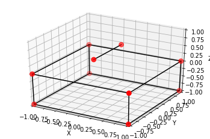

# Metódos Matemáticos em Mecânica Geométrica
Repositório para meu projeto de Iniciação Científica em Metódos Matemáticos em Mecânica Geométrica, orientador: `Prof. Dr. Alejandro Cabrera`

<div style="text-align:center"></div>

## Instalação
```
git clone https://github.com/mirandagil/geometric-mechanics
```

### Pré-requisitos

```
numpy
pyquaternion
matplotlib
scipy
```

Os pré-requisitos podem ser instalados com o arquivo `requirements.txt` contido no projeto

```
pip install -r requirements.txt
```

### Módulo GeometricMechanics

O módulo se encontra no arquivo `geometricmechanics.py`, sendo necessário apenas clonar o projeto ou baixar o arquivo.
Estando na mesma pasta do arquivo, basta:
```
import geometricmechanics as gm
```

## How-to

## Licença